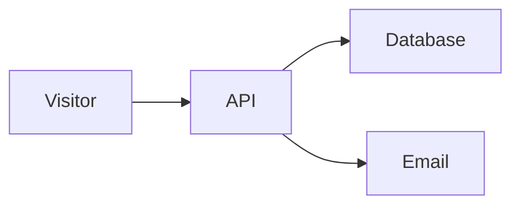

# Projects & Case Studies

A standalone [Astro](https://astro.build) site for engineering project case
studies. Content is authored in MDX; the site is fully static and deploys to
GitHub Pages.

> This lives inside the CredosisApi repo for convenience during development. It
> is an independent project and can be moved to its own repository at any time -
> nothing here depends on the parent repo.

## Stack

- **Astro** - static site generator
- **MDX** - rich case-study content
- **Tailwind CSS** - styling
- **Mermaid** - text-based diagrams that render to SVG (architecture, flows, etc.)
- Dark/light theme with `localStorage` persistence and no flash on load (FOUC-free)


## Getting started

```bash
pnpm install
pnpm dev        # http://localhost:4321
```

Other scripts:

```bash
pnpm build      # production build to dist/
pnpm preview    # preview the production build locally
```

## Adding a case study

Create a new `.mdx` file under `src/content/case-studies/`. The filename becomes
the URL slug. Provide the frontmatter defined in `src/content.config.ts`:

```mdx
---
title: "My Project"
summary: "One-line description shown on the card and page header."
role: "Your role"
timeframe: "2025"
tech: ["TypeScript", "Postgres"]
repo: "https://github.com/you/project"   # optional
liveUrl: "https://example.com"            # optional
order: 2                                   # lower shows first on the homepage
draft: false
---

## Overview

Write the case study in Markdown/MDX here...
```

## Adding diagrams (Mermaid)

Diagrams are written as text, right inside the `.mdx` file - no image files, no
external tools. Just write a ` ```mermaid ` code block and it renders to an SVG
automatically, matching the light/dark theme. Edit a line in GitHub and the
diagram updates on the next deploy.

````mdx

````

Common types: `flowchart` (boxes and arrows), `sequenceDiagram` (step-by-step
between actors), and `stateDiagram-v2` (lifecycles). See the
[Mermaid docs](https://mermaid.js.org/) for the full syntax. If a diagram has a
typo, the raw text stays visible instead of breaking the page - check the browser
console for the error.

## Project structure


```
src/
├── components/     ThemeToggle, ProjectCard, TechBadge, Section
├── content/
│   └── case-studies/   MDX case studies
├── layouts/        BaseLayout (shell), CaseStudyLayout (article)
├── pages/
│   ├── index.astro         homepage project list
│   └── case-studies/[...slug].astro   dynamic case-study route
├── styles/global.css       Tailwind + theme CSS variables
└── content.config.ts       content collection schema (Zod)
```

## Deploying to GitHub Pages

This is set up to deploy as a **project page** at
`https://foysal-munsy.github.io/projects-case-studies/`. The root portfolio at
`foysal-munsy.github.io` is a separate repo and is untouched.

First time only:

1. Push this folder to `github.com/Foysal-Munsy/projects-case-studies`
   (`main` branch).
2. In the repo settings, set **Pages → Build and deployment → Source** to
   **GitHub Actions**.

After that, every push to `main` triggers `.github/workflows/deploy.yml`, which
builds and publishes automatically. The `site` and `base` values are already set
in `astro.config.mjs`:

```js
site: "https://foysal-munsy.github.io",
base: "/projects-case-studies",
```

If you ever rename the repo, move it to a user page, or use a custom domain,
update those two values (for a user page or custom domain, set `base: "/"`).

