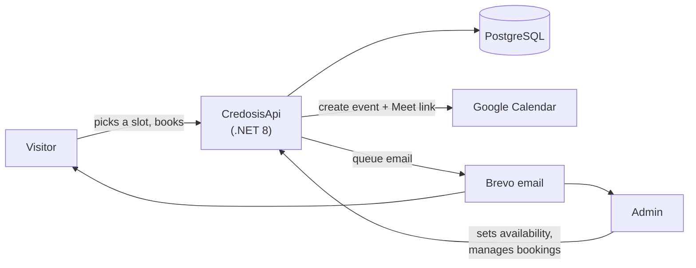
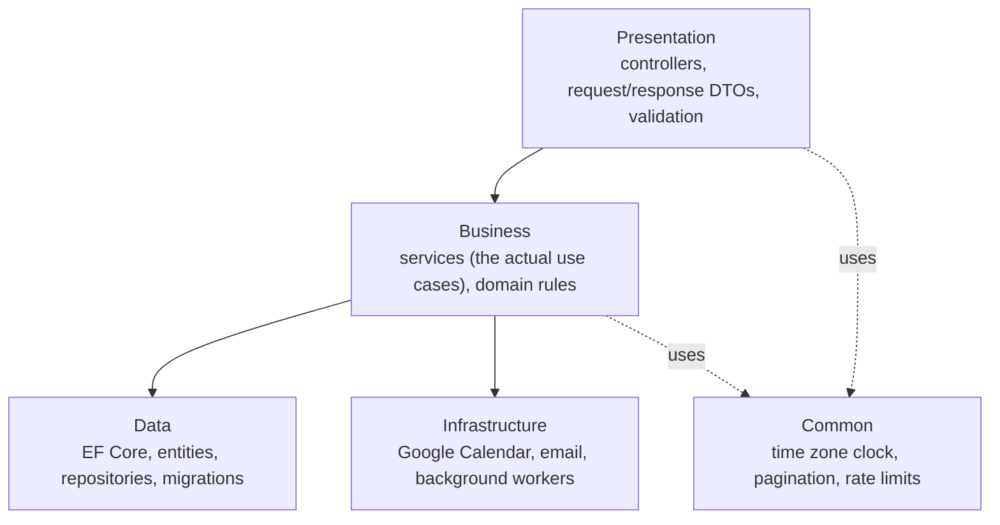
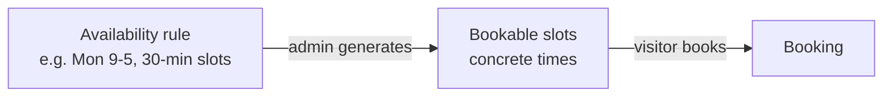
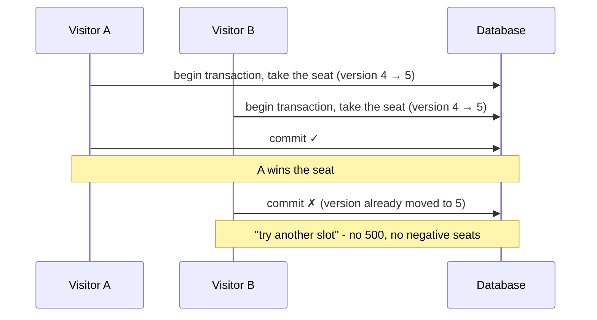
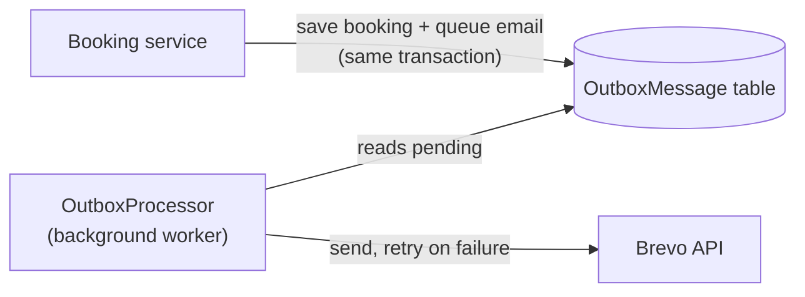

## What it is

CredosisApi is the backend for two things: a public meeting scheduler on the
Credosis marketing site, and the internal admin console the team uses to run it.

A visitor picks an open time slot and books a call in a couple of clicks, a lot
like Calendly. Behind that single click, a few things need to happen - and all
of them need to go right:

- the seat gets reserved safely, even if two people click at the same second,
- a Google Calendar event is created with a Google Meet link,
- and confirmation emails go out to both the visitor and the team.

On the other side, the team logs into an admin dashboard to set their weekly
availability, generate bookable slots, reschedule or cancel bookings, handle
contact-form messages, keep an eye on email delivery, and read an audit trail of
everything that happened.

Here's the whole thing in one picture:



The goal was a small, dependable service with no surprises in production - where
a third-party outage slows things down gracefully instead of breaking a booking,
and where every change is something you can look up afterward.

## Why build it instead of using Calendly

Credosis needed its own booking backend rather than an off-the-shelf scheduler,
for three reasons:

- **Own the booking experience.** The scheduling UI is part of the marketing
  site, so the booking logic had to plug into a custom frontend - not sit inside
  someone else's embedded widget.
- **Real calendar integration.** Every booking has to land on the team's Google
  Calendar with a working Meet link, automatically. No copy-pasting links by
  hand.
- **Email you can trust.** Confirmation, reschedule, and cancellation emails
  can't be "send it and hope." A dropped confirmation email is a missed meeting.

Once scheduling was covered, the same service picked up contact management,
analytics, and an audit trail - the everyday plumbing that turns a booking
endpoint into a tool the team can actually run the business on.

## How the code is organized

The project uses a layered structure. Each layer only depends on the one beneath
it, which keeps the business rules from getting tangled up in framework and
infrastructure details.



A few habits keep the codebase consistent:

- **Every service hides behind an interface.** Controllers depend on the
  interface, and all the wiring lives in one place (`Program.cs`). Easy to swap,
  easy to test.
- **Data access goes through repositories.** Query logic stays out of the
  service methods, so services stay readable and the queries stay testable.
- **Entities never leave the building.** Requests and responses are their own
  small record types, validated with FluentValidation. Database entities don't
  leak out to the API.
- **Errors have one shape.** A global handler turns domain exceptions
  (`NotFound`, `Conflict`, `Validation`) into standard Problem Details responses,
  so the frontend always gets a predictable, typed error.

## The interesting parts

### Booking: availability → slots → bookings

The scheduling core has three steps stacked on top of each other.



Admins define **availability rules** - day of week, start and end time, slot
length, how many people per slot. A generator then turns those rules into
concrete, **bookable slots** for a date range. Visitors book against those slots.

The key decision here: generating slots is an explicit admin action, not
something that quietly happens when a visitor loads the page. That keeps the
public "list slots" endpoint read-only, so slots never mysteriously reappear
after someone cleaned them up.

```csharp
// Public slot listing is read-only. Slots are created by the admin "generate"
// action, never as a side effect of someone viewing the page.
var effectiveStart = request.Start < now ? now : request.Start;
var slots = await _slotRepository.GetAvailableAsync(
    effectiveStart, request.End, cancellationToken);

return slots
    .Where(x => x.AvailableSpots > 0)
    .Select(/* map to response */)
    .ToList();
```

Once booked, a booking can be **rescheduled** or **cancelled**, and every one of
those changes keeps the seat count, the calendar event, and the emails in sync.

### Two people, one last seat

This is the classic race condition: two visitors try to grab the last seat at
the exact same moment. Who wins, and does the seat count stay correct?



The fix is an optimistic concurrency token plus a database transaction. Each slot
carries a `Version` number. When you book, you bump it. If someone else committed
first, your version is stale and the save fails cleanly.

```csharp
await using var transaction = await _context.Database
    .BeginTransactionAsync(cancellationToken);

var slot = await _context.MeetingSlots
    .FirstAsync(x => x.Id == request.MeetingSlotId && x.IsActive, ct);

if (slot.AvailableSpots <= 0)
    throw new InvalidOperationException("This meeting slot is fully booked.");

slot.BookedCount++;
slot.Version++;   // optimistic concurrency token
// ... create the booking, then SaveChanges + Commit
```

If a competing transaction commits first, `SaveChanges` throws a
`DbUpdateConcurrencyException`. We catch it and turn it into a friendly "try
another slot" message instead of a 500. A unique constraint also stops the same
person from booking the same slot twice, and that's translated into its own clear
error.

The result: under a race, exactly one booking wins, the other person gets a
helpful message, and the seat count never goes negative.

### Google Calendar & Meet, without letting it break bookings

Every booking creates a Google Calendar event with an auto-generated Meet link,
and adds the visitor as a guest. It authenticates with a long-lived refresh
token, so the service quietly mints fresh access tokens as they expire - no
interactive login in production.

The important design choice: the whole Google integration is **best-effort**. It
can fail, and when it does, the booking still succeeds.

```csharp
public async Task<CalendarEventResult> CreateEventAsync(/* ... */)
{
    if (!IsEnabled) return default;         // does nothing when not configured

    try
    {
        // ... build the event with a Meet link, insert it
        return new CalendarEventResult(created.Id, meetingUrl);
    }
    catch (Exception ex)
    {
        // A calendar failure must never break the booking.
        _logger.LogError(ex, "Calendar event failed; booking continues.");
        return default;
    }
}
```

A Google outage, a network blip, or missing config can never fail a visitor's
booking. Worst case, the booking is saved without a Meet link. On reschedule the
event is patched (the Meet link and guests are kept); on cancel it's deleted.

And one subtle but important detail: these calendar calls happen **after** the
database transaction commits. A slow response from Google never holds a database
lock or blocks the visitor's request.

### Email that doesn't get lost - the outbox pattern

Email reliability uses the **transactional outbox** pattern. Services never call
the email provider directly. Instead they drop a message into an `OutboxMessage`
table, in the same transaction as the booking. A background worker picks up
pending messages later and sends them, retrying with backoff if needed.



This gives two guarantees:

- **No lost emails.** If the process crashes right after a booking, the email is
  already safely stored and goes out on the next run.
- **No phantom emails.** If the booking transaction rolls back, the queued email
  rolls back with it. You never send a confirmation for a booking that didn't
  happen.

Delivery goes through the **Brevo HTTP API** (port 443) instead of SMTP, because
a lot of hosts - including Render's free tier - block outbound SMTP ports. A full
SMTP sender is still in the codebase as a drop-in backup. Every email type has a
branded HTML template on a shared layout: booking confirmation, reschedule,
cancellation, the matching admin notifications, a contact-form alert, and
admin-composed one-off emails with attachments.

### Contact management

Contact-form submissions become `Contact` records with a simple status flow
(new → contacted → resolved), an admin alert email when one arrives, and
paginated, filterable admin endpoints to work through them. It's deliberately
simple, but it means the team doesn't need a second tool just for inbound leads.

### Audit logging

Every privileged action - creating an availability rule, generating slots,
cancelling or rescheduling a booking, changing a contact's status - is written to
an append-only audit log. It records who did it and from what IP, pulled from the
request context. A query service exposes the trail with paging and filters, so
"who changed this, and when" always has an answer.

### Dashboard, analytics & auth

The admin side sits behind JWT authentication, with the settings validated on
startup so a bad config fails immediately instead of at the first request. A
dashboard service rolls up operational numbers (bookings, contacts, email
health) and an analytics service shows trends - one at-a-glance view for the
team.

## Problems I ran into

**Time zones.** Availability rules are written in Bangladesh local time, but
slots are stored as UTC. Early on, "09:00" got saved as 09:00 UTC and then shown
as 3 PM locally - clearly wrong. The fix was a dedicated `BusinessClock`: rule
times are read in the business time zone and converted to UTC when slots are
generated, and Google Calendar gets the wall-clock time plus a time-zone id so it
stores the right moment.

**What happens to slots when a rule changes.** Editing or deleting an
availability rule shouldn't strand mismatched slots or quietly drop confirmed
bookings. So the generator handles each case on purpose: future *unbooked* slots
from a changed rule get removed, future *booked* slots get deactivated (the
booking is kept, but no new bookings are accepted), and past slots are always
kept as history.

**Keeping third parties at arm's length.** Both Google Calendar and email are
treated as unreliable by default. Calendar calls are best-effort and run after
the commit; email goes through the durable outbox. Neither one can take down the
core booking flow.

**Consistent errors.** Domain exceptions map to Problem Details responses, so the
frontend can tell "slot full" (conflict) apart from "not found" apart from
"validation failed" - without matching on error message strings.

## Deployment

The service ships as a Docker image and runs on Render, configured through
`render.yaml`. Config and secrets come from environment variables (with a
gitignored `.env` for local dev), and the connection string accepts either the
native Npgsql format or a `postgres://` URI, so a provider-issued string can be
pasted in as-is. Health checks - including a database readiness probe - back the
platform's monitoring, and migrations can run automatically on startup behind a
config flag. Serilog handles structured request and app logging, and
`X-Forwarded-*` headers are honored so the real client IP and scheme survive the
reverse proxy.

## What I took away from it

- **Assume third parties will fail.** Making Google Calendar best-effort and
  email durable-by-queue turned two potential single points of failure into
  non-events. The booking succeeds either way.
- **Keep side effects out of read paths.** Making slot generation an explicit
  admin action - not a side effect of a public page load - removed a whole class
  of "why did these slots come back?" bugs.
- **Model time zones on purpose.** A single `BusinessClock` boundary between
  local-time rules and UTC storage prevented a whole category of off-by-hours
  bugs.
- **Optimistic concurrency is usually enough.** For last-seat contention, a
  version number plus a transaction and a friendly retry beat heavier locking -
  simpler code and a better experience.
- **Auditability is a feature.** Logging every privileged action from day one
  made the admin console trustworthy and debugging almost boring.
