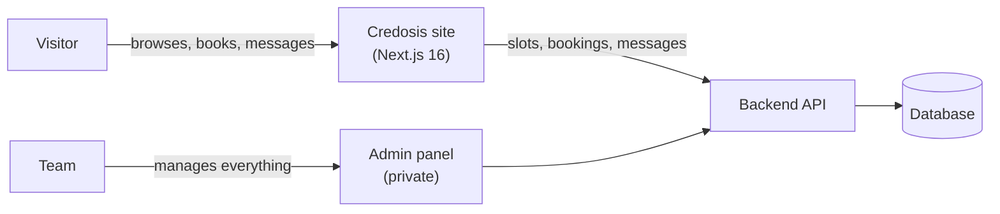
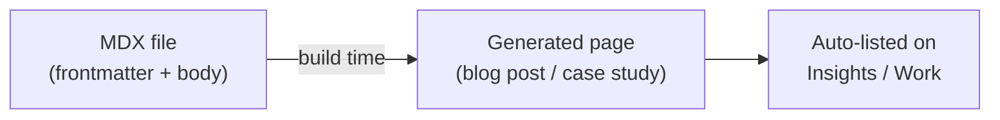
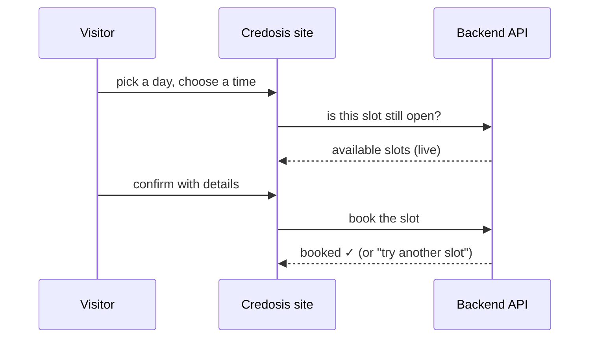

export const base = import.meta.env.BASE_URL;
export const img = (name) =>
  `${base.replace(/\/$/, "")}/images/credosis-web/${name}`;

## What it is

I built the [credosis.com](https://credosis.com) website as part of the
engineering team at [Credosis](https://credosis.com), a software company. It's
the public front door for the business - the place people land on to learn what
the company does, read its articles, browse its work, get in touch, and book a
meeting - plus the internal tooling the team uses to run everything the site
brings in.

I worked on it as a full-stack engineer, across both sides: the public marketing
site people see, and the private admin panel the team uses behind the scenes.

Here's the whole thing in one picture:

The goal was simple: make the site fast, look clean and modern, and give the
team a way to handle everything that comes in - messages, meeting requests,
emails - without needing a developer every time.

## My role

I was the full-stack engineer on this project. That meant working across the
whole thing - the front-end pages and animations people interact with, the forms
and booking flow, and the connection to the back-end API that powers it all. I
also built a private internal dashboard for the team, kept intentionally light
here since it isn't public.

## Tech stack

| Area               | Tools                                 |
| ------------------ | ------------------------------------- |
| Framework          | Next.js 16 (App Router)               |
| UI                 | React 19, Tailwind CSS v4             |
| Animation          | Motion                                |
| Content            | MDX (for blog posts and case studies) |
| Forms & validation | React Hook Form, Zod                  |
| Language           | TypeScript                            |

## The interesting parts

### A fast, animated marketing site

The public site is the front door for the company. I built the home page as a
set of custom animated sections - an animated hero, a world map, a services
overview, and a few interactive touches - all tuned to load fast and feel smooth
without getting in the way of the content. Everything is responsive, so it looks
right on phones, tablets, and desktops.

<figure class="cs-figure">
  
  <figcaption>Home page - the animated hero and services overview.</figcaption>
</figure>

The services section breaks down what the company offers, laid out to stay
scannable on any screen size:

<figure class="cs-figure">
  
  <figcaption>Services - what Credosis offers, kept scannable.</figcaption>
</figure>

And the footer ties the site together with navigation, contact details, and
calls to action:

<figure class="cs-figure">
  
  <figcaption>
    Footer - navigation and calls to action across the site.
  </figcaption>
</figure>

### Content non-developers can manage (MDX)

The company writes articles and showcases projects, so I set up an MDX-driven
content system for both the Insights blog and the Work case studies. Each entry
is its own content file with a cover image, tags, and structured sections, and
the site turns that into a polished page automatically.

The key decision here: writers add a new article or case study by dropping in a
file - no code changes needed to publish. That keeps the team unblocked and
means the site's content grows without a developer in the loop.

  <figure class="cs-figure">
    
    <figcaption>
      Work - each case study rendered from a content file.
    </figcaption>
  </figure>
  <figure class="cs-figure">
    
    <figcaption>Insights - articles authored in MDX.</figcaption>
  </figure>

### A contact form that doesn't get spammed

The contact page validates everything as you type - the rules live in Zod, so
the same schema guards the form and the submission. Clear, inline error messages
guide people through it, and a hidden "honeypot" field quietly catches spam bots
without making real visitors solve a captcha. On submit, the message goes
straight to the team.

<figure class="cs-figure">
  
  <figcaption>Contact - inline validation with a hidden honeypot.</figcaption>
</figure>

### A meeting booking flow, without double-booking

One of the more interesting pieces. Visitors pick an open time slot and book a
call right on the site. The tricky part is making sure two people can't grab the
same slot - availability updates in real time, and the booking logic prevents
double-booking so the team never ends up with a clash.

The front-end talks to the booking API, reflects live availability, and handles
the "someone just took that slot" case gracefully instead of failing on confirm.

### An internal admin panel (private)

Alongside the public site, I built a private admin panel the team uses to manage
everything the site brings in - messages, meeting bookings, and outgoing emails.
It's for internal use only, so it's intentionally not shown here for
organization security reasons. What I'll say is that it was built with security
and reliability in mind: access is locked down, and the email side was designed
to retry gracefully if a send fails, so nothing quietly gets lost.

## Problems I ran into

**Fast and pretty at the same time.** Lots of animation can make a site feel
heavy. Balancing the polished, animated feel with fast load times pushed me to
be deliberate about how and when things load, so the motion never fights the
content.

**Real-time booking without clashes.** Preventing two people from booking the
same slot sounds simple but takes careful handling. Keeping availability
accurate in real time and surfacing a friendly "try another slot" - instead of a
hard error - was the part I'm most happy with.

**Content the team can own.** Setting up the MDX system so writers publish on
their own meant thinking about the people who use the thing day to day, not just
the code. Frontmatter validation keeps a malformed post from breaking the build.

**Reliable email delivery.** Designing the email flow to retry on failure
instead of silently dropping messages taught me to think about the unhappy
paths, not just the happy one.

## What I took away from it

- **Design for the people who run it.** MDX-driven content and a self-serve
  admin panel removed the developer from everyday publishing and operations.
- **Handle the unhappy path first.** Live availability plus a graceful "slot
  taken" message turned a potential booking bug into a non-event.
- **Motion is a budget.** Treating animation as something to spend carefully kept
  the site both polished and fast.
- **Validate at the edges.** One Zod schema guarding the contact form, and
  frontmatter validation guarding content, stopped whole classes of bugs before
  they shipped.
